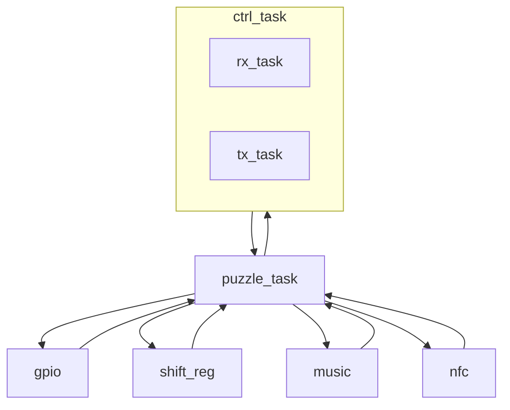

| Supported Targets | ESP32 | ESP32-C2 | ESP32-C3 | ESP32-S2 | ESP32-S3 |
| ----------------- | ----- | -------- | -------- | -------- | -------- |

# Puzzle_Prop_Template
The following project is a FreeRTOS implementation of an escape room prop that is powerful, robust, 
and provides low latency operator debugging and error checking. This source code is compiled and
included in TODO_NAME_HERE boards.

## How to configure
By default, this template is configured to enable all components included in the TODO_NAME_HERE board.
If compiling this template on a standalone ESP32 board, be sure to open the configuration options, set
the GPIO pins, and enable/disable components as necessary.

## Project contents
Each component of the prop is outlined below. Examples on how to use each component can be found by clicking 
on the component.

[puzzle](components/puzzle) - The primary puzzle logic. Controls the logical flow of the prop. Edit this component when designing a prop.

[main](main) - The main script. Runs first. Initializes every component then removes itself from memory.

[twai_can](components/twai_can) - The CAN component. Handles communication to and from other props.

[sound](components/sound) - The sound component. Plays sound clips stored in the DFPlayer Mini when prompted.

[gpio](components/gpio_prop) - The GPIO component. Sets, reads, and writes basic GPIO implementations such as relays, buttons, and LEDs. 
Complex GPIO instructions are handled outside of this component.

[shift_reg](components/shift_reg) - The shift register component. Handles reading SN74HC165n registers and writing to SN74HC595n registers.

## Task Control Flow

## Global Variables
### uint8_t rx_payload[9], tx_payload[9]

| **xx_payload**  |       [0]      |    [1]    |   [2]   | [3]-[8] |
|-----------------|:--------------:|:---------:|:-------:|:-------:|
| **Description** | Flags & Length | Target_ID | Command | Payload |

#### Command
See [CAN Commands](../twai_can/README.md#command)

#### Flags & Length
The 4 MSB determine if the command is a read (0000) or write (0001). The 4 LSB describe the length of the payload to read proceding the index. Maximum command payload is 6 bytes.

#### Payload
The payload data accompanying the command.

rx_task waits for semaphore to be available to overwrite rx_payload

component receives command to read rx_payload and gives a semaphore when finished reading

component waits for semaphore to be available to overwrite tx_payload

tx_task receives command to read tx_payload and gives a semaphore when finished reading